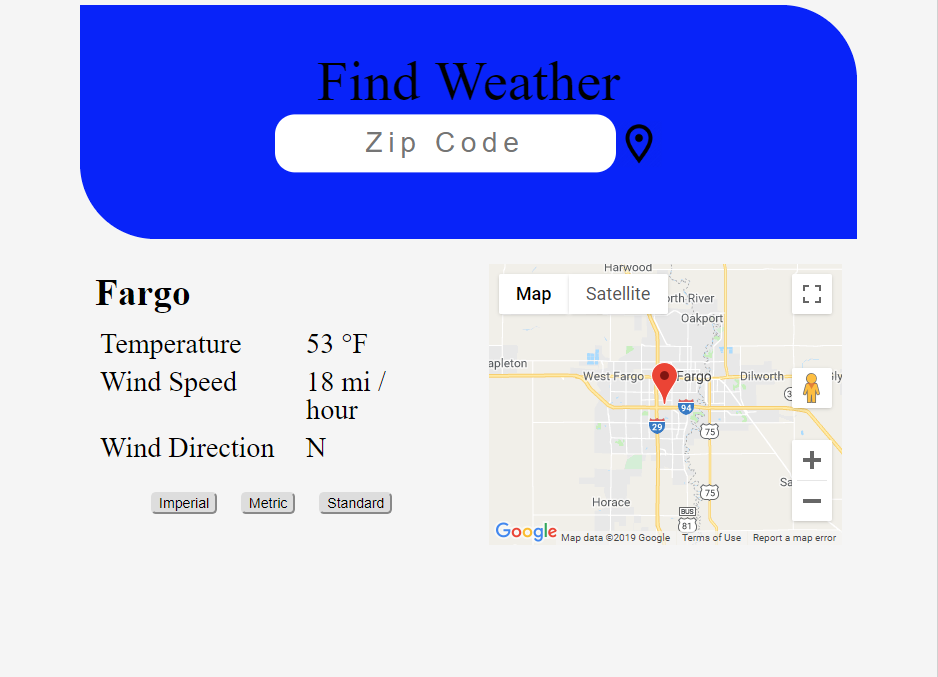

# Weather-App
A weather application that uses the built in geolocation feature or an entered zip code to grab the location of the user. With that location it fetches the current weather data from the openweathermap.org API and displays it on the webpage. With that location it also displays a Google Map of where they are.

Live Demo: https://awesome-newton-cbf623.netlify.com/

